  <h1>Nathaniel Ryan Ponce</h1>
  
<strong>Software Engineer | Systems Administrator</strong>

  
<samp>Web applications / backend systems / AI integrations</samp>

  

  
  

---

### About Me

- A **BS Computer Science** student at the **University of San Carlos** with a strong interest in self-hosting, Linux systems, and the infrastructure that keeps things running.
- Runs a homelab and learns through managing real services: configuring servers, working through networking problems, and investigating why something broke instead of only restarting it.
- Interested in system administration, DevOps, and cybersecurity.
- Builds experience one setup at a time and keeps notes on what works, what fails, and what could be done differently next time.

---

### My Tech Stack

#### Languages & Frontend

  

#### Backend & Databases

  

#### DevOps & Infrastructure

  

---

### GitHub Stats & Contribution Activity

  
  

 

  

